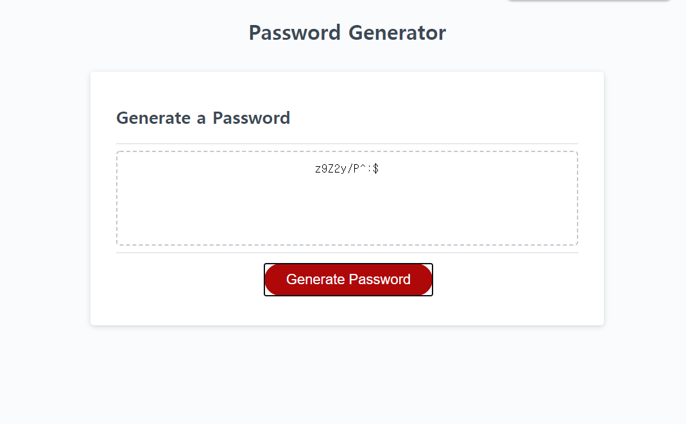

# Homework 3 - Password Generator

## Built With (Used Languages)

* HTML5
* CSS3
* JavaScript

## References
* [MDN web docs](https://developer.mozilla.org/) - read documentation about JavaScript.
* [W3Schools](https://www.w3schools.com/) - read documentation about JavaScript.
* [Markup Validation Service](https://validator.w3.org/) - to validate HTML page and correct errors in HTML page.
* [Google Chrome](https://www.google.com) - used Console to debug any errors occured in JavaScript.

## Overview (Contents)

This HTML with JavaScript is for my Homework 3 - Password Generator

In this activity, A user(client) requested a app that generates random password for security for his company.

I created a html pages that contains a app which creates a strong password for each time user clicks on the button.

This app creates a password from 8 characters to max 128 characters, It cannot be less than 8 characters or more than 128 characters, then it would not work.

The password contatins at least one of each character type such as, lowercase letters, uppercase letters, numbers, and special characters. 

For example: a password will be created something like this: ```z9Z2y/P^:$ ```

After user selects what user wants to have on their password, it will display on the text-box on HTML page.

## Page Preview



## Contact

Jonghyun Kang - misterjaykay@gmail.com

Project Repo Link: https://github.com/misterjaykay/password-generator

Preview Link: https://misterjaykay.github.io/password-generator


